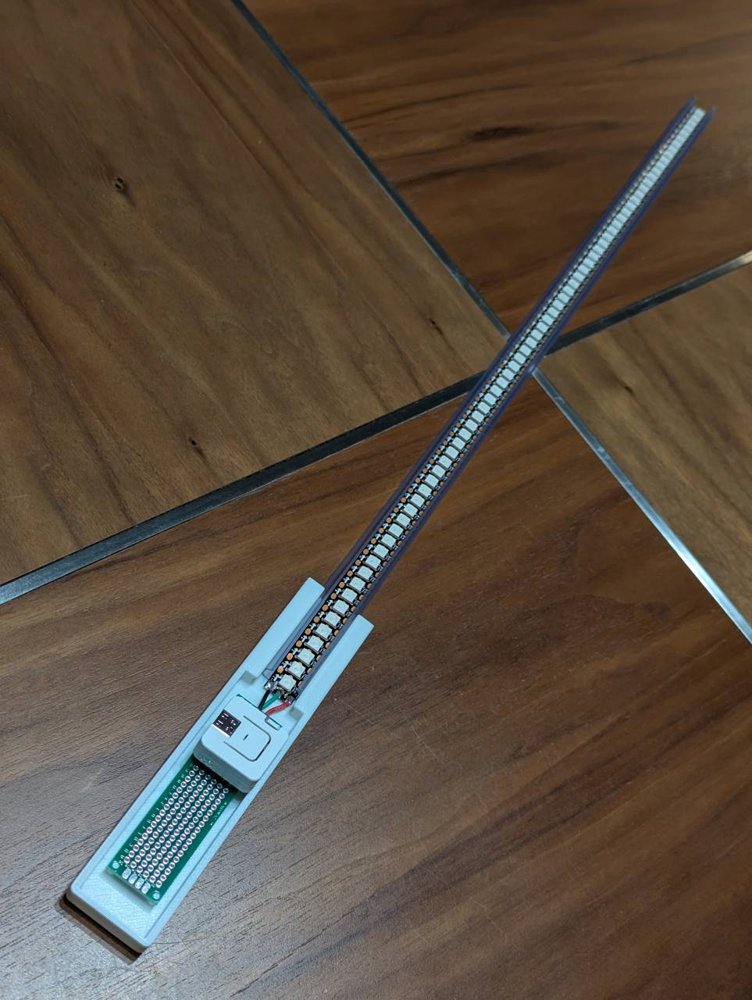

# AtomS3 WS2812B poi

This project controls WS2812B strip as a poi.

## Usage

1. Connect 5V, GND and GPIO8 on AtomS3 Lite to WS2812B strip.
2. Supply power through USB port on AtomS3

## Supported Hardware

* [M5Stack AtomS3 Lite](https://docs.m5stack.com/en/core/AtomS3%20Lite)

## Build Environment

* PlatformIO

## Dependencies

* m5stack/M5Unified@^0.2.1
* hideakitai/ESP32DMASPI@^0.6.4
